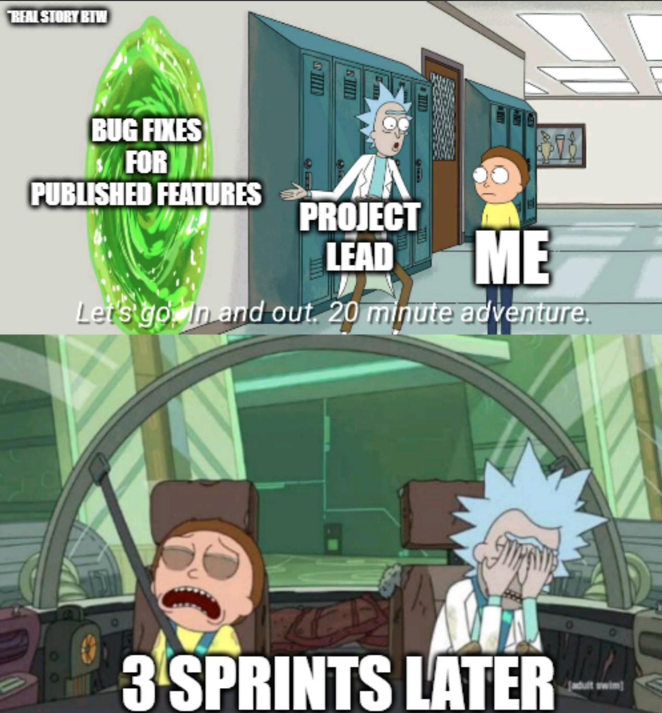

## What is Software Engineering?

Software Engineering is used across all sectors in our lives, from public utilities such as power grids, to our private fortunes such as our banking system, it serves as the invisible backbone to our modern society.

The primary duties of a software engineer are to apply engineering principles and programming languages to design, develop, and maintain computer software, hence the title. To break it down further, software engineers identifies a problem that exist but can be solved with software (e.g. A repetitive task done manually). Then, the software engineers develop a solution with coding languages such as Python (e.g. Automating the repetitive task). Next, they must collaborate with others, such as the product managers, clients, and other team members to propose and apply the solution, turning real world needs into working software technology. Last but not least, they must maintain and update the application, release updates, and improve the software over time.

## Experience with Software Engineer

My experience as a software engineer began when I first joined my high school robotics team, where we had to program the robot to compete in the [2022 FIRST Robotics Competition](https://jxiong1.github.io/projects/frc.html). Writing code that controlled the entire robot drivetrain made me realize the endless problem-solving potential of computer science and software development. I quickly picked up skills in object-oriented programming, leveraging classes, functions, and variables to build clean, robust code architecture.

The next summer, I applied the same programming skills that I had learned to my first personal project, an [Automated Report Generator](https://jxiong1.github.io/projects/automated-report-generator.html). The entire project revolved around the tedious problem of manually entering data from a secure online Point of Sale portal into an Excel spreadsheet, and I was tasked with implementing a solution to automate this process. I came up with the idea of using a browser automation tool to collect the data and a Python library to write to the Excel sheet. Through iterative testing and user feedback, I delivered a finalized version of the product that solved the problem. This marked my first true experience with software engineering.

## Future Goals and Experience with Software Engineering

Looking ahead, I am eager to learn more about software engineering. Recently, I took part in an internship focused on ServiceNow, a cloud-based platform designed to automate and manage enterprise operations. As a developer intern, I learned how to create, deploy, and maintain applications on the platform, much like a software engineer. Though it involved limited scripting, we utilized tools such as AJAX and APIs, which built a foundational understanding of how a platform handles client-server communication. I look forward to deepen my understanding of these integration tools and unlock more advanced software engineering opportunities. 

