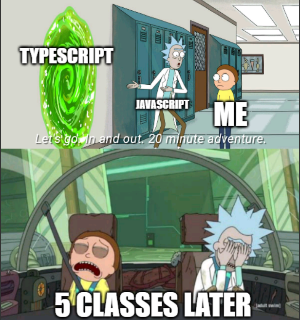

## What is Software Engineering?

Software Engineering is used across all sectors in our lives, from public utilities such as power grids, to our private fortunes such as our banking system, it serves as the invisible backbone to our modern society.

The primary duties of a software engineer is to apply engineering principles and programming languages to design, develop, and maintain computer software, thus the name software engineer. To break it down further, software engineers identifies a problem that exist but can be solved with software (e.g. A repetitive task done manually). Then, the software engineer would come up with a solution with coding languages such as Python (e.g. Automating the repetitive task). Next, they must collaborate with others, such as the product managers, clients, and other team member to propose and apply the solution, turning real world needs into working software technology. Last but not least, they must maintain and update the application, release updates, and improve the software over time.

## Experience with Software Engineer

My experience as a software engineers when I first joined my high school robotics team, where we have to program the robot the compete in the FIRST Robotics Competition in 2022. I was instantly hooked by how scripting on a computer can move an entire robot drivetrain and the endless problems that can be solved with programming. I quickly pick up skills on object-oriented programming, using classes, functions and variables to organize my code and made it more robust. The next summer, I applied the same programming skills that I learned to my first personal project, Automated Report Generator. The entire project revolves around the problem of manually typing in data from an online secured Point of Sale Portal.

## Athletic Software Enigneering with TypeScript

After a few classes of TypeScript, I feel like it's still hard for me to grasp the unusual syntax of it. During Workout of the Day (WOD), where we have 30 minutes to script a solution from a prompt, I spent about a quarter of my time fixing syntax, as it mixed and matched with both JavaScript and Java/C++/C in my mind. But with enough practice, I believe TypeScript syntax will burn into my brain like every other language I've learned.

