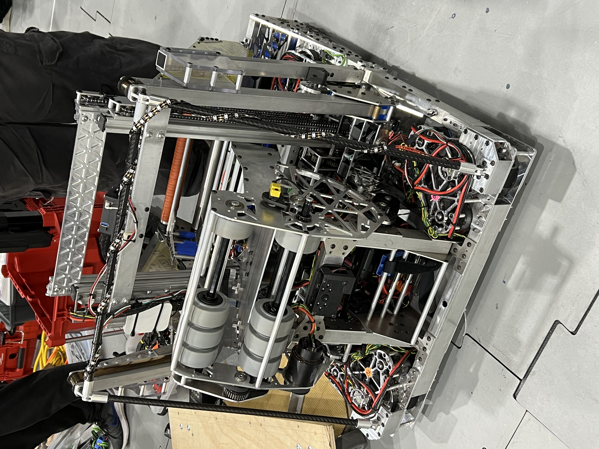

The FIRST Robotics Competition is a high school match-based robotics competition where teams from around the world build robots that work together to complete tasks. I was involved in one of the teams, Team Kika Mana out of McKinley High School, where we were guided and mentored by industry professionals to build a robot for the competition. The team is primarily divided into two major subsystems - Mechanical team, which designs, manufactures and assembles the robot, and the Electrical team, which is in charge of wiring and programming it. With great help from our mentors, our teams participated in the following events and won the following awards during my time as a member (2022 - 2024)

* **2024**
  * FIRST Championship - Daly Division *(Rank: #13)*
  * Hawaii Regional *(Rank: #2)*
    * Regional Winner
    * Autonomous Award
  * Los Angeles Regional *(Rank: #1)*
    * Regional Winner

* **2023**
  * Hawaii Regional *(Rank: 5)*
    * Autonomous Award

* **2022**
  * Hawaii Regional *(Rank: 7)*
    * Regional Finalist

### Subsystem Contributions

Over three seasons on the team, I performed hardware wiring and software telemetry integrations

* **Hardware & Training:** Constructed dedicated testbenches and assisted new members on basic Java programming to acclerating the onboarding process

* **Telemetry & Programming:** Programmed addressable LED lights to provide drivers and pit crew with a instant visual status of the robot (e.g., Autonomous vs. Teleop modes).

* **Testing the Robot:** Programmed motor control scripts for early stage protyping. Enabling mechanical team to test, iterate, and refine designs.

* **Chassis Integration * Autonomous Testing:** Supported electrical wiring for the robot and provided diagnostic feedback during autonomous trials.

### Biggest Takeaways

As my first ever robotics project, the team has helped me build the foundations of Object-Oriented Programming and practical electrical integration abilites, skills that I still apply in my projects and my education path as an engineer.

