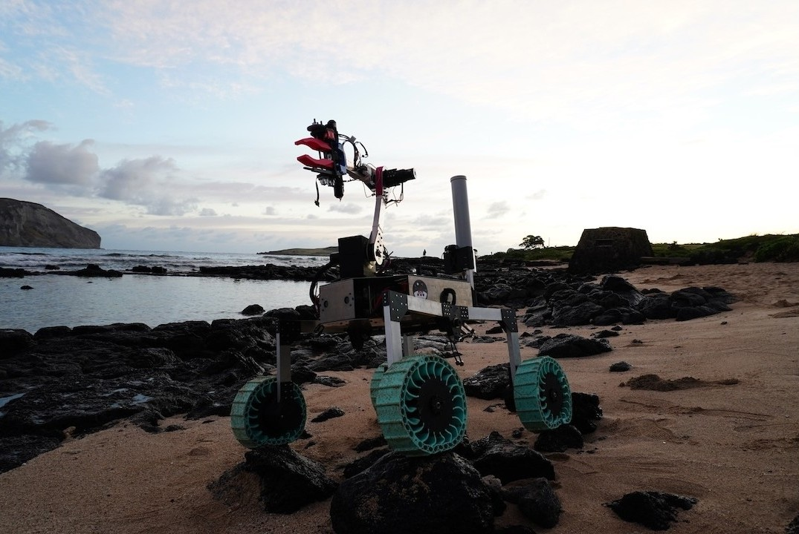

Team Robotic Space Exploration (RoSE) is an undergraduate, Vertically Integrated Project (VIP) that focuses on both robotics and space exploration as a team at the University of Hawaiʻi at Mānoa.

The project participated in the University Rover Challenge, where teams from around the world build rovers to simulate tasks and missions completed in the Martian environment. This competition is held once a year in Utah, due to the similarity of the terrain between it and Mars.

At the 2026 URC competition, Team RoSE placed 28th out of 116 globally.

The competition consists of four major missions: Science, Delivery, Equipment Servicing, and Autonomous Navigation. Each mission requires the rover to complete tasks such as sample collection, operating a robotic arm to manipulate objects, and autonomous navigation from waypoint to waypoint.

### My Contribution

My primary contribution to Team RoSE was developing control for the chassis of the rover, allowing the rover to be controlled using a controller. This is done using the `ros2_control` control framework. By mapping the definition of movement of the controller to the four individual wheel joints, it allows joystick input from the controller to be converted seamlessly into actual movement of the rover.

<pre>        Operator Controller (Joystick / Gamepad)                           |                           v  (geometry_msgs/msg/Twist)                   [ ROS 2 Environment ]                +--------------------------+                 |  Diff Drive Controller   |  <-- Translates joystick velocity to                 |    (ros2_control plugin) |      target wheel speeds (rad/s)                +--------------------------+                           |                           v  (Joint Velocity Commands)                +--------------------------+                 | Hardware Interface Node  |  <-- Packs wheel speeds into CAN frames                |     (Custom C++ Plugin)  |      using SocketCAN (e.g., ID 0x01, 0x02)                +--------------------------+                           |                           | CAN Bus (CAN-High / CAN-Low physical lines)                           v                 CAN Motor Controllers       <-- Decodes CAN frames, reads encoders,                                                 and runs localized velocity PID loops                           |                           v                 4-Wheel Rover Chassis        <-- Executes physical driving movement  </pre>

I also worked on the payload subsystem of the rover, which requires joystick input from a controller to control the movements of mechanical parts driven by motors and servos. The primary job of the payload subsystem is to collect scientific samples from the soil, then store and analyze them onboard the rover.

<pre> Operator Controller         |         v      ROS 2 Node         |         | Serial Communication         v       Arduino         |         v   Motor Controllers         |         v Motors/Servos driving the Payload mechanical parts   (e.g., Augers, elevators, carousels) </pre> 

### What I Learned

My greatest takeaway from Team RoSE is the ability to use code/scripts to control mechanical and physical objects. With the help of the ROS 2 framework and Arduino IDE, I was able to contribute my part in getting the rover to move in preparation for the URC competition.

Other great takeaways I had include troubleshooting and teamwork, as I spent countless hours troubleshooting code/scripts and the physical wiring of the rover's subsystems with others.

